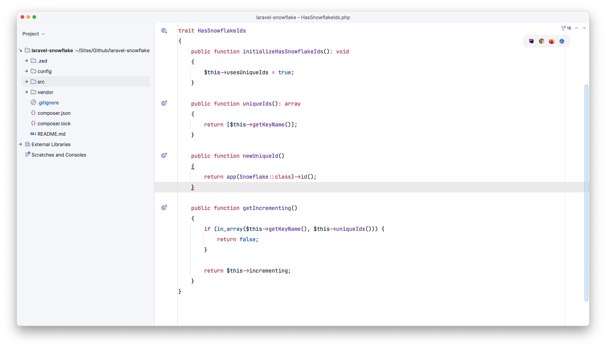
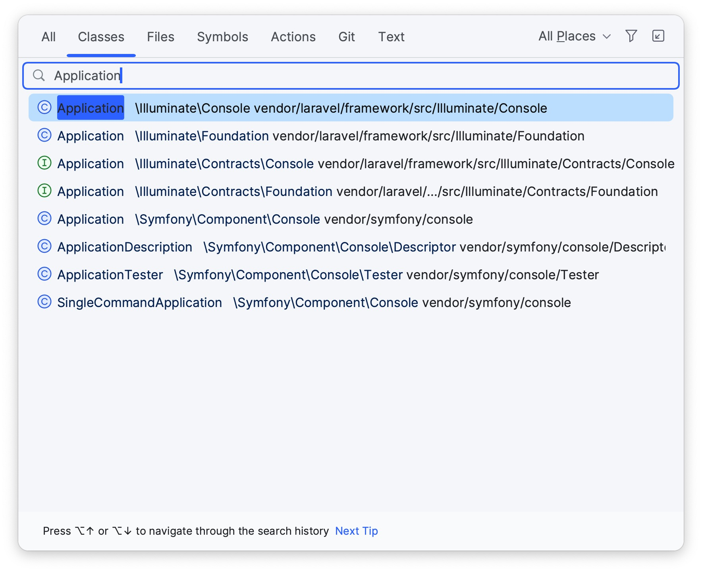
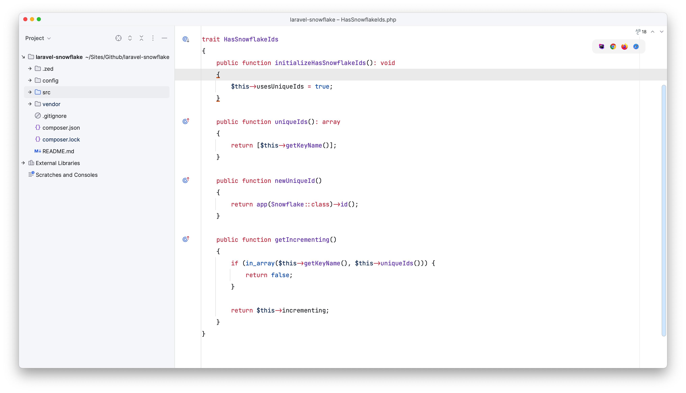
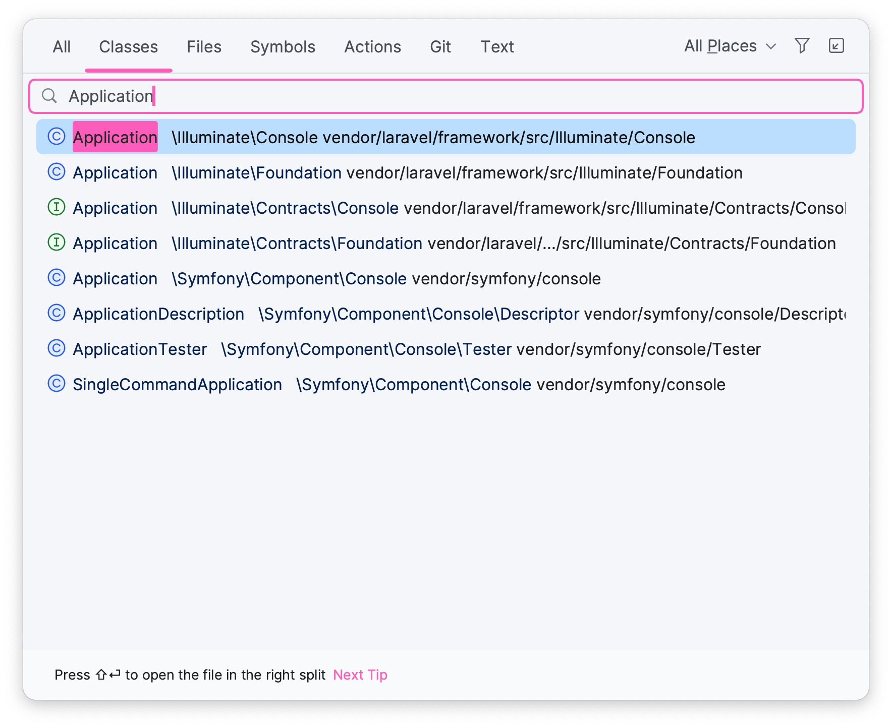

# PhpStorm Preferences

`Light` & `Minimalist` to focus only on the code itself.

## Require Plugins
1. `Material Theme UI`
2. `Atom Material File Icons`
3. Highly recommend `Laravel Idea` & `GitHub Copilot`

## Screenshot

## Ramark
Accent Color: `#387BFF`(Sky Blue 天空蓝) or `#FF79C6`(Dracula Pink 猛男粉)
