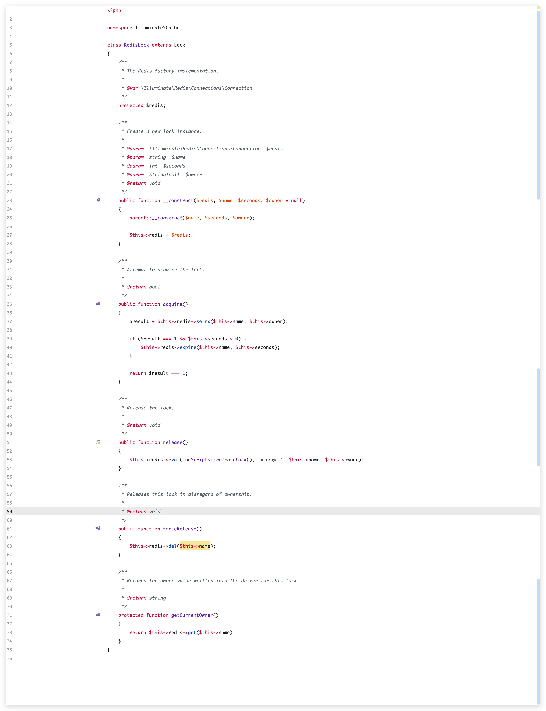
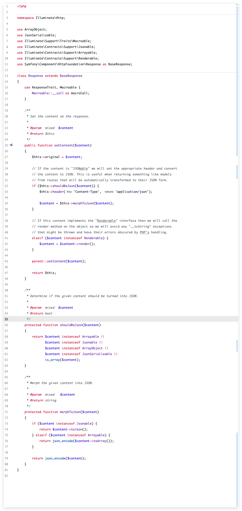

# PHPStorm Gayhub/Bright/Sexless Theme

## 更新记录
- `20190823`  查看最近文件全部大写问题调整 只保留了 `View/ToolWindows/Project` 和 `View/ToolWindows/Terminal` 快捷键 `CMD + 3` 快捷键分配给了 `Status Bar`
- `20190822-01` 更新全局变量显示颜色 `#1841E1` 不同变量显示同一个颜色， 更新 GraphQL 文本显示颜色 `#1790FF`

